slidenumbers: true
build-lists: true

# Workflow e Infra para aplicações Laravel

---

# Quem?!

Gabriel Koerich

26 anos
Formado em administração
Desenvolvedor PHP há pelo menos 9 anos e Laravel há 5
Co-fundador do Bulldesk, responsável pela área financeira e de tecnologia

---


^ O Bulldesk é um software de automação de marketing e CRM, nele é possível criar formulários, landing pages, automações de marketing, e-mail marketing e ter uma visão geral de todas as negociações com seus clientes.

^ Aplicação multi tenant, com uns 600 usuários acessando por mes

^ Lançamos o bulldesk em março deste ano e temos uma média de 4.000.000 de requests por mês.

---


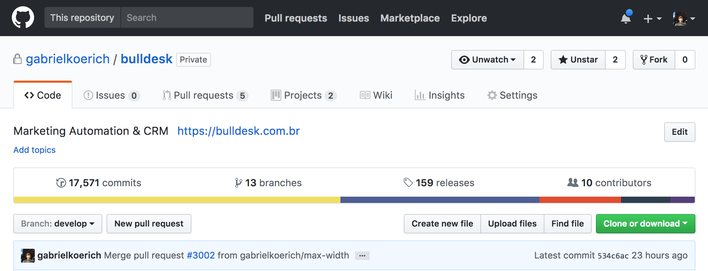

---

# Development Workflow & <br>Source Management

--- 

# Development Workflow & Source Management

- Individuals & interactions
- Development Guidelines, Coding Style, PSRs
- Local Environment
- ~~Database dumps~~
- Migrations & Seeds

^ Um projeto é feito por pessoas, por isso os indivíduos e suas interações são a parte mais importante de todo o desenvolvimento de software. Claro que não podemos esquecer dos processos, são eles que nos fazem continuar no caminho certo, mas as pessoas sempre vêm em primeiro lugar.

^ Nós vamos falar também sobre as diretrizes de desenvolvimento, como cada dev deve se portar ao desenvolver e comitar códigos novos para sua aplicação.

^ Como configurar seu ambiente local, o modo como vão instalar o repositório e rodar todos os migrations e seeds. Nenhum dev deve receber o dump de seu banco de dados de produção. Uma dica interessante é ao criar um novo model/migration, criar também um factory e um novo seed.

^ Tudo isso deve estar bem definido para qualquer dev novo entrar e não perder muito tempo configurando o projeto em sua máquina. 

^ Todo 

--- 

# Git Flow


--- 

# Github Flow

- Anything in master is deployable
- Every new branch should be created off of master 
- Branches must have descriptive names (create-cache-manager, improve-auth, refactor-acl)
- Pull requests must be reviewed by at least 2 people
- When ready, you can merge and deploy immediately

---

# Github Flow


[https://guides.github.com/introduction/flow](https://guides.github.com/introduction/flow)

---


---

# Coding Style / PSRs 

bleh

--- 

# Laravel Valet

```bash
# Install PHP/Composer/MySQL/Redis local

# On MacOS
$ composer global require laravel/valet

# On Linux
$ composer global require cpriego/valet-linux

$ valet install

$ cd ~/Projects && valet park

# All directories in ~/Projects will be acessible at http://{folder}.dev
```

---

# Vessel (Docker)

##PHP 7.1, MySQL 5.7, Redis & NodeJS with NPM, Yarn & Gulp

```bash
# Install docker

$ composer require shipping-docker/vessel

# Register Vessel\VesselServiceProvide if not on Laravel 5.5

$ php artisan vendor:publish --provider="Vessel\VesselServiceProvider"

$ bash vessel init

$ ./vessel start

# Acessible at http://localhost
```

[vessel.shippingdocker.com](vessel.shippingdocker.com)

^ Esse cara que fez o Vessel é o fideloper...

---

# Continuous Integration

---

# Continuous Integration

- Config (.env, dotfiles)
- Tests
- Code Coverage (>70%)
- Code Quality

^ Falar sobre Travis CI, Clode Climate, Scrutinizer
^ Explicar sobre testes automatizados, cobertura de testes, qualidade de código, integração contínua e mostrar as ferramentas que podem ser utilizadas para ver qualidade, coverage e rodar os testes.

---


---


---

# Provision/Deploy Platforms

---

# Provision/Deploy Platforms

- Continuous Deployment
- *Zero* downtime
- Multi servers/instances
- PHP 7.1
- SSL & http2

^ Falar sobre Forge, Envoyer, Let's Encrypt
^ Mostrar como funciona o provisionamento de máquinas para produção no Forge (sem xdebug, com opcache) e a integração com deploy contínuo com zero downtime no Envoyer, citando que é possível criar vários servidores em rede, cada um fazendo o seu papel para escalar a aplicação.

---

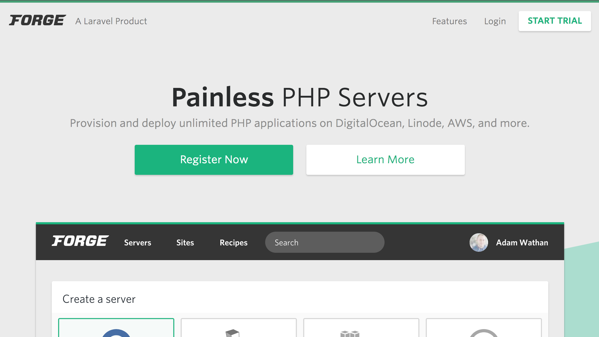

---


---


---


---


---

# Load Balancer Proxy

```bash
$ composer require fideloper/proxy

# Register Fideloper\Proxy\TrustedProxyServiceProvider

$ php artisan vendor:publish --provider="Fideloper\Proxy\TrustedProxyServiceProvider"
```

```php
// Http/Kernel.php
protected $middleware = [
    //...
    \Fideloper\Proxy\TrustProxies::class,
];

// config/trustedproxy.php
return [
    'proxies' => [
        '192.168.10.10', // Load balancer's IP address
    ],
//...
```

---

# Nginx Proxy


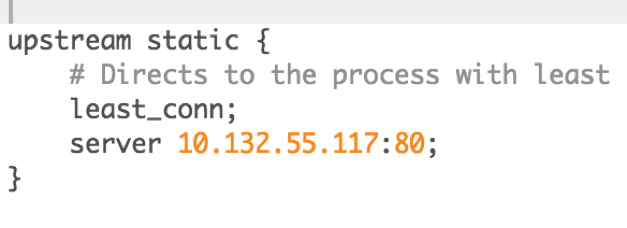

---

# Nginx Proxy

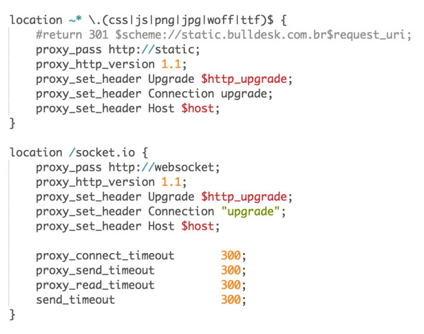

---


---

# Recipes


---


---

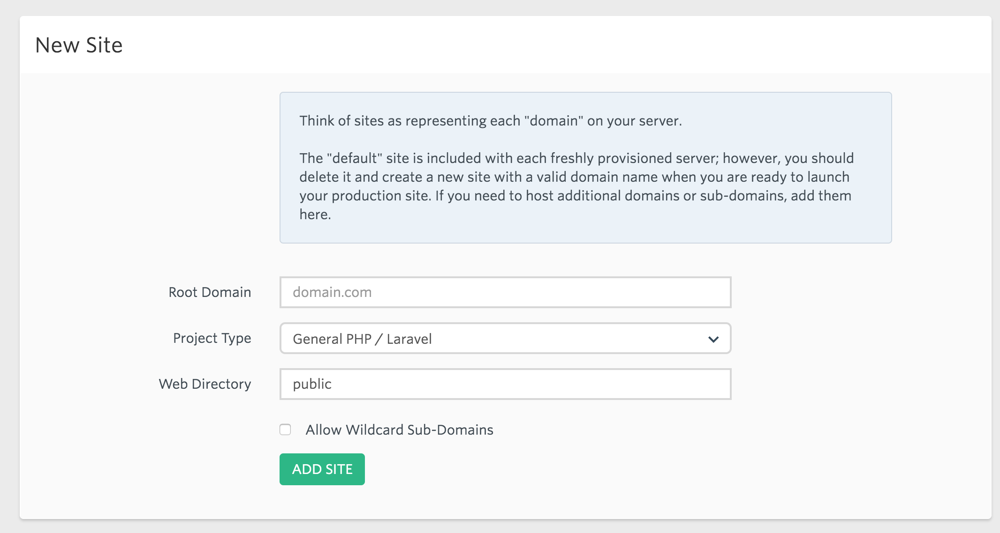

---


---


---


---


---

Mostrar todos os hooks

---

```php
//...
'connections' => [

    'mysql' => [
        'write' => [
            'host' => env('DB_WRITE_HOST', env('DB_HOST', '127.0.0.1')),
        ],

        'read' => [
            'host' => [
                env('DB_WRITE_HOST', env('DB_HOST', '127.0.0.1')),
                env('DB_READ_HOST', env('DB_HOST', '127.0.0.1')),
            ],
        ],

        'backup' => [
            'host' => env('DB_BACKUP_HOST', env('DB_READ_HOST', '127.0.0.1')),
            'arguments' => '--single-transaction --skip-tz-utc',
        ],
    //...
];
```

^ 

---

# Next steps 

- Measure *x*% increase on requests using [keen.io](keen.io)
- Automatically provision new app servers using Forge API and recipes
- Automatically add those servers to the load balancer
- Drop those servers when not needed anymore
- Drop old app servers and spin up new ones every *n*

---

#Monitoring & Security

---

#Monitoring, Security & Optimization

- CDN
- Centralized logs & exceptions
- Notifications
- Backups
- Load tests

^ Falar sobre Cloudflare, Papertrail, Bugsnag, Newrelic, backup jobs and loader.io, beanstalkd console
^ Explicar que os logs devem ser centralizados no mesmo serviço, já que eles vêm de várias máquinas diferentes. Dizer que é interessante logar tudo o que acontece no app para facilitar o debug. Falar sobre o monitoramento via Newrelic, logs via Papertrail e exceptions centralizadas no Bugsgnag. Testes de carga no loader.io

---

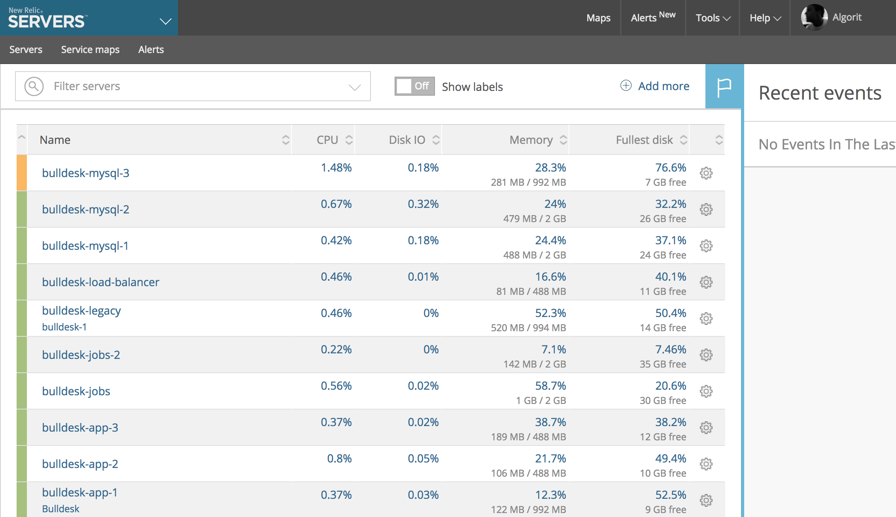

---

# Digital Ocean Monitoring

```bash
$ curl -sSL https://agent.digitalocean.com/install.sh | sh
```

^ Como as coisas não são tão belas assim no mundo real, o Newrelic acabou alterando a plataforma deles e cancelando o plano free antigo. O meu dura até por agora em novembro, mas felizmente, para salvar a vida de todos os pobres (brasileiros) desse mundo, o Digital Ocean lançou o seu monitoring, que é muito simples de ser instalado.

^ mostrar o script install

---

# Digital Ocean Monitoring

```bash
$ curl -sSL https://agent.digitalocean.com/install.sh | sh
```
<br>
Na ilha formosa, cheia de graça, o time da raça
É povo é gente, é bola pra frente
É só coração, o meu Avaí
Avaí meu Avaí, da ilha és o Leão
Avaí meu Avaí, tu já nasceste campeão

---

# Digital Ocean Monitoring

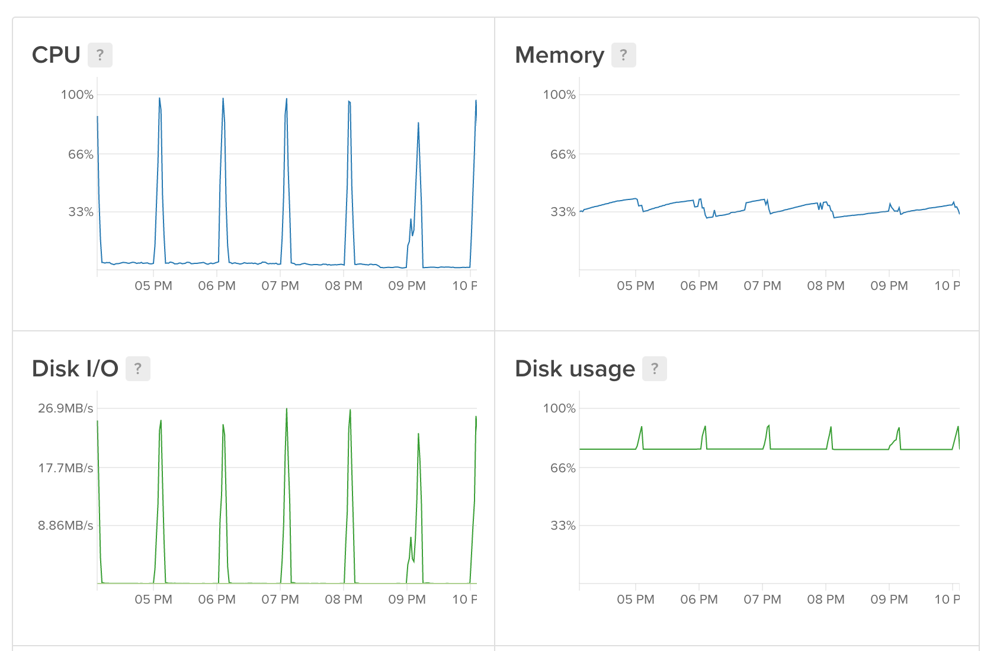

---

# Digital Ocean Monitoring

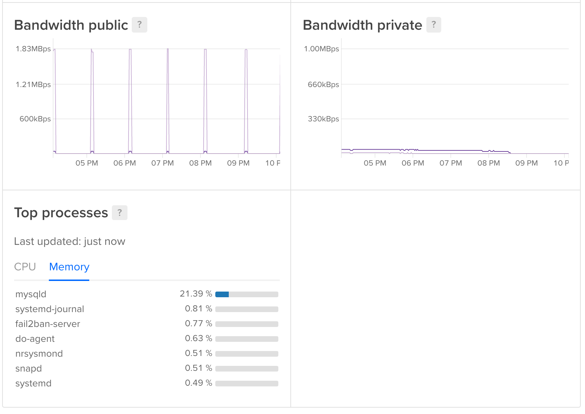

---

# Digital Ocean Monitoring


---

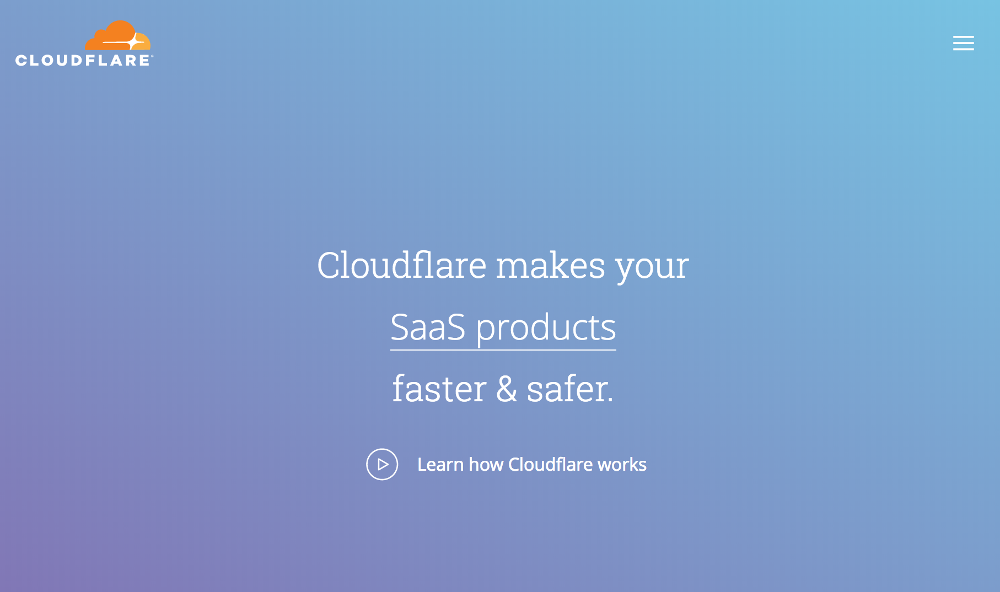

---

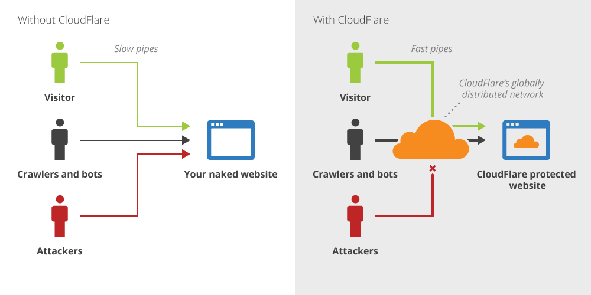

---

```php
/**
 * Set the CloudFlare conneting IP and https if applied.
 *
 * @param  \Illuminate\Http\Request $request
 * @param  \Closure                 $next
 * @return mixed
 */
public function handle($request, Closure $next)
{
    if (! app()->environment('production')) {
        return $next($request);
    }

    if ($request->server->has('HTTP_CF_CONNECTING_IP')) {
        if ($request->isSecure()) {
            $request->server->set('HTTPS', true);
        }

        $request->server->set('REMOTE_ADDR', $request->server->get('HTTP_CF_CONNECTING_IP'));

        return $next($request);
    }

    logf('CF: Blocked request to %s from %s', [$request->fullUrl(), $request->ip()]);

    return new Response('', 404);
}
```

---


---

```php
/**
 * Get the path to a versioned asset file.
 *
 * @param  string $asset
 * @return string
 */
function versioned($asset)
{
    static $production, $base, $deploy, $sha;

    $production = app()->environment('production');

    if (is_null($base)) {
        $base = $production ? 'https://static.bulldesk.com.br/' : '/';
    }

    if ($production === false) {
        return $base.$asset . '?v=' . str_random(3);
    }

    if (is_null($deploy)) {
        $deploy = public_path('build/deploy');
    }

    if (is_null($sha) && file_exists($deploy)) {
        $sha = file_get_contents($deploy);
    }

    if (! empty($sha)) {
        return $base.$asset . '?v='.$sha;
    }

    return $base.$asset;
}

// Use:
<link href="{{ versioned('build/styles/app.css') }}" rel="stylesheet">
<script type="text/javascript" src="{{ versioned('build/scripts/app.js') }}"></script>
```

---


---

```php
// LogServiceProvider.php

/**
 * The papertrail log format.
 *
 * @var string
 */
protected $papertrailFormat = '%channel%.%level_name%: %message% %extra%';

/**
 * Configure the application's logging facilities.
 *
 * @return void
 */
public function boot()
{
    if ($this->app->environment('production', 'staging')) {
        $syslog = new SyslogHandler('laravel');
        $syslog->setFormatter(new LineFormatter($this->papertrailFormat));

        $this->app['log']->getMonolog()->pushHandler($syslog);
    }
}
```

---


---

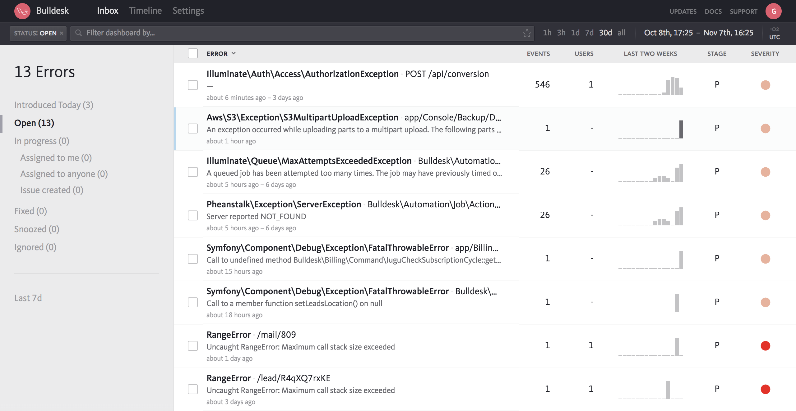

---


---

# Backups

```bash
$ composer require backup-manager/backup-manager 

# OR
$ composer require backup-manager/laravel

# OR
$ composer require spatie/laravel-backup
```

[https://docs.spatie.be/laravel-backup](https://docs.spatie.be/laravel-backup)

^ Na época instalei o backup-manager e não queria ficar refém de um package laravel por causa das atualizações / precisava de umas opções a mais para o backup do innoDB. Mas hoje acho que o melhor e mais configurável é o laravel-backup

---

```php
(...)

/**
 * Execute the backup command.
 *
 * @return void
 */
public function handle()
{
    $database = $this->option('database') ?: 'mysql';
    $destination = $this->option('destination') ?: 's3';
    $destinationPath = 'dump_'. (new Carbon)->format('Y_m_d_H_i_s').'.sql';
    $compression = 'gzip';

    $this->info('Dumping database and uploading...');

    $destinations = [new Destination($destination, $destinationPath)];

    $this->backupProcedure->run($database, $destinations, $compression);

    $completePath = 'database/' . $destinationPath;

    $this->info(sprintf('Successfully dumped %s, compressed with %s and store it to %s at %s',
        $database,
        $compression,
        $destination,
        $completePath
    ));

    $last = new Carbon('last day of this month');

    // Delete file in 10 days if this not the last day in month.
    if ((new Carbon)->isSameAs('d/m/Y', $last)) {
        $this->info('Scheduled job to delete the backup file ' . $completePath . ' in 10 days.');

        dispatch((new DeleteFile($completePath . '.gz', 's3_backup'))->delay(24 * 60 * 60 * 10));
    }
}
```
---

# Lições aprendidas

---

# 1. Não otimize ou escale prematuramente, mas esteja preparado pra isso

---

# 2. Não crie abstrações desnecessárias

---

# 3. Use micro serviços somente se puder dar manutenção à eles

<!-- ---

# 4. Seja cético em relação aos novos *trends* -->

---

# 4. Estude/aprenda sozinho e aproveite tudo o que a internet te dá de graça

---


---


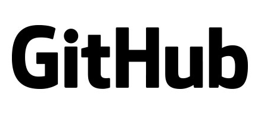  

 

 

 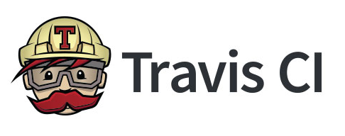

---


# PHP Sucks

^ Pessoal, agora um assunto muito sério. Todo mundo aqui foi zoado pelo menos uma vez na vida por usar PHP. Que php é lixo, as funções não seguem nenhum padrão e que é realmente muito fácil ver código lixo em php. Mas será que o PHP é tão ruim assim? Na verdade, até a versão 5.2 era muito ruim mesmo. Nem namespace a gente tinha. Até a 5.3 a gente tinha que escrever array LITERALMENTE escrevendo array(). 

---


# PHP Sucks?!

^ O php começou como uma linguage de template. Foi assim que o Rasmus imaginou o PHP. A verdade é que o PHP é muito simples e deixa fazer o que você quiser. Quem tem que ser bom é você. Quem tem que usar os padrões é você. Com o laravel é a mesma coisa, ele te deixa fazer um MONTE de merda. Eu já vi código em Laravel pior que código em Wordpress.
^ Mas sério, muita coisa mudou de lá pra cá, e a partir da versão 7 eu finalmente acho que os desenvolvedores PHP serão cada vez mais valorizados. O futuro é lindo pra gente. 

---

> With great power comes great responsibility
-- Michel Temer

---


---

# Referências

[https://guides.github.com/introduction/flow](https://guides.github.com/introduction/flow)
[https://gabrielkoerich.com/talks/infra](https://gabrielkoerich.com/talks/infra)

---